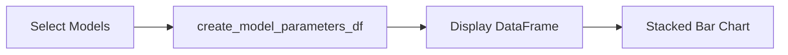
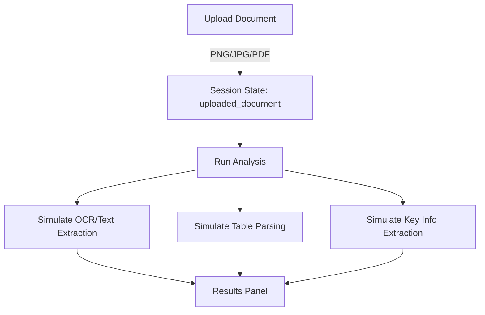

id: 692477eb32c068d8687c237f_documentation
summary: Gemma 3 Technical Report Documentation
feedback link: https://docs.google.com/forms/d/e/1FAIpQLSfWkOK-in_bMMoHSZfcIvAeO58PAH9wrDqcxnJABHaxiDqhSA/viewform?usp=sf_link
environments: Web
status: Published
# GemmaVision-QuantAdvisor: A Streamlit Codelab for Financial Data Engineers

## 1. Why This App Matters: Context, Goals, and Concepts
Duration: 4:00

GemmaVision-QuantAdvisor is a Streamlit application designed to help Financial Data Engineers explore and compare Gemma 3 models through a practical, interactive interface. It foregrounds three high-impact domains for production decision-making:

- Multimodal financial document understanding: Simulate how vision-enabled LLMs handle financial reports, invoices, tables, and charts.
- Quantization strategies: Compare memory footprints for bfloat16 and quantized checkpoints across model sizes, with and without KV cache.
- Performance benchmarks: Visualize comparative metrics such as Elo scores, zero-shot capabilities, and long-context perplexity.

Key concepts you’ll learn and apply:
- Model architecture and scaling: how vision encoder, embedding, and non-embedding parameters contribute to total parameter counts with $P_T = P_V + P_E + P_{NE}$.
- Quantization trade-offs: how bfloat16 vs Int4 vs SFP8 can reduce memory footprint and throughput cost, plus the role of KV caching.
- Multimodal pipeline planning: practical flow for document ingestion, OCR, table extraction, and key information extraction.
- Benchmark-driven decision-making: how to interpret Elo, radar charts of abilities, and long-context performance plots to guide model selection and deployment.

Who should use this:
- Financial Data Engineers deploying LLMs for automated report analysis, invoice parsing, financial QA, or multi-modal extraction workflows.
- MLOps engineers evaluating cost-performance tradeoffs and memory constraints across hardware.

<aside class="positive">
This codelab shows a full model-evaluation workflow, complete with charts, controls, caching, and simulated multimodal processing. Developers can adapt it quickly to real LLM endpoints.
</aside>

<aside class="negative">
The sample data for quantization and benchmarks in this codelab are placeholders. Validate with your organization’s benchmark data before making deployment decisions.
</aside>

<button>
  [Download Starter Project (GitHub)](https://github.com/example/gemmavision-quantadvisor)
</button>


## 2. Project Setup and Running the App
Duration: 3:30

- Prerequisites:
  - Python 3.10+
  - pip, virtualenv or conda
  - Basic familiarity with Streamlit, pandas, and matplotlib

- Create a project and install dependencies:
```console
git clone https://github.com/example/gemmavision-quantadvisor
cd gemmavision-quantadvisor
python -m venv .venv
source .venv/bin/activate    # On Windows: .venv\Scripts\activate
pip install -r requirements.txt
```

- Example requirements.txt:
```txt
streamlit==1.39.0
pandas==2.2.3
matplotlib==3.9.2
seaborn==0.13.2
numpy==2.1.2
Pillow==11.0.0
```

- Launch:
```console
streamlit run app.py
```

- Folder structure:
```console
.
├── app.py
└── application_pages
    ├── home_page.py
    ├── model_overview.py
    ├── quantization_strategies.py
    ├── multimodal_document_understanding.py
    └── performance_benchmarks.py
```

<aside class="positive">
Use a virtual environment to avoid dependency conflicts and ensure reproducibility across teams and CI.
</aside>


## 3. Architecture and Navigation
Duration: 3:00

The app uses a multi-page architecture controlled by a single navigation selectbox in app.py. Pages are modularized under application_pages.

High-level architecture:
```mermaid
graph TD
    A[User] -->|Browser| B[Streamlit Frontend]
    B --> C[app.py]
    C --> D[Home Page]
    C --> E[Model Overview]
    C --> F[Quantization Strategies]
    C --> G[Multimodal Document Understanding]
    C --> H[Performance Benchmarks]

    subgraph Data & Caching
      I[pandas DataFrames]
      J[st.cache_data (2h TTL)]
    end

    E --> J
    F --> J
    H --> J
    E --> I
    F --> I
    H --> I

    subgraph Visualization
      K[matplotlib]
      L[seaborn]
    end

    E --> K
    E --> L
    F --> K
    F --> L
    H --> K
    H --> L
```

Core navigation (from app.py):
```python
page = st.sidebar.selectbox(
    label="Navigation",
    options=[
        "Home",
        "Model Overview",
        "Quantization Strategies",
        "Multimodal Document Understanding",
        "Performance Benchmarks"
    ]
)

if page == "Home":
    from application_pages.home_page import main
    main()
elif page == "Model Overview":
    from application_pages.model_overview import main
    main()
# ...
```

<aside class="positive">
Each page exposes a main() function. This keeps code organized, discoverable, and testable.
</aside>


## 4. Home Page: Orientation and Learning Goals
Duration: 2:00

The Home page introduces the application’s purpose and sets expectations for users.

Highlights:
- Why Gemma 3 matters for financial document workflows.
- Learning goals aligned to model sizing, quantization, and benchmarks.
- Guidance on required libraries and ecosystem tools.

Code reference:
```python
# application_pages/home_page.py
st.markdown("""
### Introduction: GemmaVision-QuantAdvisor
...
#### Learning Goals:
- Understand Gemma 3 architecture and performance.
- Evaluate quantization impact on memory and efficiency.
- Compare multimodal and general reasoning abilities.
""")
```

<aside class="positive">
Use this page to align team members on goals before diving into benchmarks and comparisons.
</aside>


## 5. Model Overview: Understanding Parameter Counts
Duration: 6:00

This page visualizes parameter distribution across Gemma 3 variants and shows how total parameters scale with model size.

Concepts:
- Components: Vision Encoder, Embedding, Non-embedding.
- Total parameter counts:
$$ P_T = P_V + P_E + P_{NE} $$

User flow:


Key functions and flow:
```python
# application_pages/model_overview.py

_GEMMA_MODEL_PARAMETERS_DATA = {
  "Gemma3-4B-IT": {"Vision Encoder Parameters": 417, "Embedding Parameters": 675, "Non-embedding Parameters": 3209},
  ...
}

@st.cache_data(ttl="2h")
def get_gemma_model_parameters(model_name: str) -> dict:
    return _GEMMA_MODEL_PARAMETERS_DATA.get(model_name, {})

@st.cache_data(ttl="2h")
def create_model_parameters_df(selected_models: list) -> pd.DataFrame:
    model_parameters = []
    for model in selected_models:
        params = get_gemma_model_parameters(model)
        if params:
            params['Model'] = model
            model_parameters.append(params)
    df = pd.DataFrame(model_parameters)
    if not df.empty:
        df['Total Parameters (M)'] = df[["Vision Encoder Parameters","Embedding Parameters","Non-embedding Parameters"]].sum(axis=1)
    return df

def plot_bar_chart(df: pd.DataFrame, ...):
    fig, ax = plt.subplots(figsize=(10, 6))
    df.set_index('Model')[['Vision Encoder Parameters','Embedding Parameters','Non-embedding Parameters']].plot(
        kind='bar', stacked=True, ax=ax, colormap='viridis'
    )
    st.pyplot(fig)
    plt.close(fig)
```

How to use:
- Select one or more models in the multiselect to compare parameter distributions.
- Inspect the table to see Total Parameters (M).
- Study the stacked bar chart to understand scaling and the presence/absence of vision encoders across variants.

<aside class="negative">
The values are sample references aligned to external tables and may not reflect the latest report. Always cross-verify with official model cards or technical papers.
</aside>


## 6. Quantization Strategies: Memory and Efficiency
Duration: 7:30

This page explores quantization options and their impact on memory usage across different Gemma 3 models, with or without KV cache.

What you can do:
- Choose quantization type: bfloat16, Int4, SFP8.
- Toggle KV caching on/off to see memory footprint changes.
- Compare memory usage across model sizes.

Core logic:
```python
# application_pages/quantization_strategies.py

@st.cache_data(ttl="2h")
def describe_quantization_strategy(strategy_name: str) -> str:
    descriptions = {
        "bfloat16": "Standard 16-bit floating-point precision...",
        "Int4": "4-bit integer quantization...",
        "SFP8": "8-bit scaled floating-point format...",
        "KV Cache Status (No)": "Memory used for weights, KV cache not included.",
        "KV Cache Status (Yes)": "Memory includes weights and KV cache."
    }
    return descriptions.get(strategy_name, "Unknown quantization strategy.")

_MEMORY_FOOTPRINT_DATA = {
  "Model": ["Gemma3-1B", "Gemma3-1B", ...],
  "Quantization": ["bfloat16","bfloat16","Int4","Int4", ...],
  "KV Caching": ["No","Yes","No","Yes", ...],
  "Memory (GB)": [2.0,3.5,0.5,1.0, ...]  # Example values
}

def plot_memory_footprint_chart(df: pd.DataFrame, title: str):
    fig = plt.figure(figsize=(12, 7))
    sns.barplot(data=df, x='Model', y='Memory (GB)', hue='Quantization', errorbar=None, palette='deep',
                hue_order=['bfloat16','Int4'])
    st.pyplot(fig)
    plt.close(fig)
```

User interactions:
- Radio button: Select Quantization Type.
- Checkbox: Enable KV Caching.
- Table: Shows memory footprint filtered by quantization and KV cache state.
- Chart: Grouped bar plot to visualize memory savings.

<aside class="positive">
Quantization (Int4/SFP8) can dramatically reduce memory usage and costs in production, especially for long-context workloads.
</aside>

<aside class="negative">
The memory numbers here are placeholders. Use your hardware profiles and real quantized checkpoints for accurate planning.
</aside>


## 7. Multimodal Document Understanding: Simulated Workflow
Duration: 6:30

This page simulates a multimodal pipeline where users upload a financial document (image or PDF) and receive simulated outputs for OCR, table extraction, and key information extraction.

Workflow:


Code reference:
```python
# application_pages/multimodal_document_understanding.py

uploaded_file = st.file_uploader("Choose...", type=["png","jpg","jpeg","pdf"])
if uploaded_file is not None:
    st.session_state["uploaded_document"] = uploaded_file
    if st.button("Run Analysis"):
        with st.spinner("Analyzing document... (Simulated)"):
            if uploaded_file.type.startswith('image'):
                st.image(uploaded_file, use_column_width=True)
                st.markdown("Simulated OCR Output: ...")
                st.markdown("Simulated Table Extraction: ...")
                st.markdown("Simulated Key Information Extraction: ...")
            elif uploaded_file.type == 'application/pdf':
                st.write("PDF document uploaded. Displaying a placeholder...")
                st.markdown("Simulated OCR Output: ...")
                ...
```

How to use:
- Upload a sample invoice/report image or a PDF.
- Click Run Analysis.
- Review simulated outcomes to understand how a real LLM+vision pipeline would present results.

<aside class="positive">
This stub lets you plug in your OCR engine (e.g., Tesseract or cloud vision APIs), table parsers, and LLM endpoints later without changing the UI.
</aside>


## 8. Performance Benchmarks: From Elo to Long-Context
Duration: 8:30

This page centralizes multiple evaluation views you can toggle on and off:
- Chatbot Arena Elo Scores
- Zero-shot General Abilities (radar chart)
- Other Benchmarks (e.g., Financial QA)
- Long Context Performance (perplexity vs. context length)

Key components:
```python
# application_pages/performance_benchmarks.py

@st.cache_data(ttl="2h")
def get_chatbot_arena_elo_scores_df(): ...

@st.cache_data(ttl="2h")
def get_zero_shot_abilities_df(): ...

@st.cache_data(ttl="2h")
def get_other_benchmarks_df(): ...

@st.cache_data(ttl="2h")
def get_long_context_performance_df():
    # Reshapes dict-of-lists into tidy DataFrame for seaborn lineplot
    ...

def plot_elo_scores_bar_chart(df, title): ...
def plot_radar_chart(df, models, categories, title): ...
def plot_long_context_line_chart(df, title):
    ax.set_xscale('log', base=2)
```

User flow:
- Select benchmarks via multiselect.
- Click Generate Visualizations.
- Inspect tables and charts for each chosen benchmark.

Visualizations:
- Elo Scores: Compare models via a bar chart.
- Zero-shot Abilities: Radar chart across categories like Vision, Code, Science, Factuality, Reasoning, Multilingual.
- Other Benchmarks: Simple table to compare across task categories, e.g., Financial QA.
- Long Context: Perplexity curves with log-scaled x-axis for context length.

<aside class="positive">
Use the radar chart to quickly spot capability gaps across model families and pick the right model for your domain-specific tasks.
</aside>

<aside class="negative">
The benchmark values are illustrative. Replace with authentic evals from your datasets and evaluation harnesses before drawing conclusions.
</aside>


## 9. State, Caching, and Performance Patterns
Duration: 4:00

- Caching:
  - st.cache_data(ttl="2h") is used for read-only data and computed DataFrames.
  - The TTL string "2h" ensures data refreshes every two hours.

- Session state:
  - Example: st.session_state["uploaded_document"] for holding the uploaded file across interactions.

- Matplotlib memory hygiene:
  - Always close figures via plt.close(fig) after st.pyplot(fig) to prevent memory leaks in long sessions.

Snippet:
```python
@st.cache_data(ttl="2h")
def create_model_parameters_df(selected_models):
    ...
    return df

fig, ax = plt.subplots(...)
st.pyplot(fig)
plt.close(fig)
```

<aside class="positive">
Caching and clean plotting are essential in multi-user Streamlit deployments for stability and responsiveness.
</aside>


## 10. Visualization Templates and UX Notes
Duration: 3:00

- Stacked bar for component breakdown:
  - Compare architectural components side-by-side, stacked for a clean overview of total counts.

- Grouped bar for quantization vs. non-quantized:
  - Group by model; hue as quantization for quick comparison.

- Radar charts for multi-ability overview:
  - Great for capability radar across many categories at once.

- Line charts for scaling laws and long-context:
  - Use log-scaled axes when plotting context length to avoid skew.

<aside class="positive">
Consistent color palettes (e.g., viridis, deep) and rotated tick labels improve readability for wide model name lists.
</aside>


## 11. Replacing Simulation with Real LLM and OCR Pipelines
Duration: 7:00

Roadmap to productionize the Multimodal page:

- OCR:
  - Replace simulated OCR with a real OCR engine.
```python
# pseudo-code
from your_ocr import run_ocr
text = run_ocr(uploaded_image_or_pdf)
```

- Table extraction:
  - Use libraries like camelot, pdfplumber, or deep-learning-based table detectors for robust table parsing.

- Key information extraction:
  - Call your LLM endpoint with a structured prompt:
```python
# pseudo-code
payload = {
  "prompt": f"Extract company name, report date, key figures from:\n{text}",
  "temperature": 0.0
}
response = call_llm(api_url, api_key, payload)
```

- Safety and compliance:
  - Redact PII and sensitive data before sending content to third-party APIs.
  - Apply access controls and audit logging on document uploads.

<aside class="negative">
Never upload confidential documents to external services without legal approval and appropriate data governance controls.
</aside>


## 12. Troubleshooting and Testing
Duration: 5:00

Common issues:
- Blank charts:
  - Ensure selections (multiselect, radio, checkbox) are not empty.
- Memory buildup:
  - Verify plt.close(fig) is called after plotting.
- Caching anomalies:
  - Clear cache with streamlit cache clear or restart the server if stale data persists.
```console
streamlit cache clear
```

Lightweight tests:
```python
# tests/test_caching.py
from application_pages.model_overview import create_model_parameters_df

def test_total_parameters_calculation():
    df = create_model_parameters_df(["Gemma3-4B-IT"])
    assert "Total Parameters (M)" in df.columns
    row = df.iloc[0]
    assert row["Total Parameters (M)"] == row["Vision Encoder Parameters"] + row["Embedding Parameters"] + row["Non-embedding Parameters"]
```

<aside class="positive">
Automate sanity checks for DataFrame schemas and plotting functions to catch regressions early.
</aside>


## 13. Summary and Next Steps
Duration: 2:00

You now have a working Streamlit application that:
- Compares Gemma 3 models by parameter composition and total size.
- Demonstrates quantization impacts on memory budgets, including KV cache considerations.
- Visualizes benchmark-inspired comparisons from Elo to long-context performance.
- Simulates a multimodal ingestion pipeline ready to be wired into real OCR, table extraction, and LLM backends.

Suggested next steps:
- Swap placeholder data with your internal benchmarks and logs.
- Add new pages for latency/throughput testing under different quantization regimes.
- Integrate deployment knobs (GPU selection, batch sizes, kv-cache quantization) and capture telemetry.
- Extend the document page with annotation tools for human-in-the-loop validation.

<button>
  [Download Starter Project (GitHub)](https://github.com/example/gemmavision-quantadvisor)
</button>
