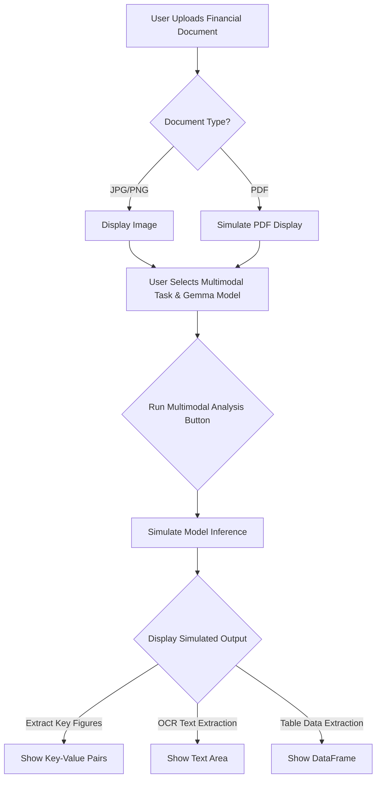

id: 692477eb32c068d8687c237f_documentation
summary: Gemma 3 Technical Report Documentation
feedback link: https://docs.google.com/forms/d/e/1FAIpQLSfWkOK-in_bMMoHSZfcIvAeO58PAH9wrDqcxnJABHaxiDqhSA/viewform?usp=sf_link
environments: Web
status: Published
# Building a GemmaVision-QuantAdvisor with Streamlit

## Introduction to GemmaVision-QuantAdvisor and Setup
Duration: 0:05

<aside class="positive">
This introductory step provides essential context for the application. Financial Data Engineers will gain an understanding of why Large Language Models (LLMs) are crucial in finance, the specific value proposition of Gemma 3 models, and the core learning objectives of this codelab. It sets the stage for a deeper dive into model architecture, optimization, and performance.
</aside>

Welcome to the GemmaVision-QuantAdvisor Streamlit Application! This platform is designed specifically for **Financial Data Engineers** to explore, evaluate, and compare the latest Gemma 3 models, focusing on their capabilities for multimodal financial document understanding, quantization strategies, and performance benchmarks.

Large Language Models (LLMs) are becoming increasingly important in financial data processing, from automated report analysis to intelligent invoice parsing. Gemma 3, with its enhanced multimodal features and improved efficiency, offers a compelling solution. This application aims to provide the necessary insights to make informed deployment decisions tailored to specific hardware constraints and operational costs.

### Learning Goals:
Upon completing this codelab, you will be able to:
-   Understand the architectural and performance characteristics of Gemma 3 models.
-   Evaluate the impact of different quantization techniques on memory footprint and efficiency.
-   Compare Gemma 3's performance in multimodal tasks, general intelligence, math, and reasoning against previous Gemma versions and other state-of-the-art models.
-   Utilize quantitative benchmarks and visualizations to guide strategic model deployment in financial data engineering workflows.

### Application Architecture Overview

The GemmaVision-QuantAdvisor is built using Streamlit, a Python framework for creating web applications. The application's structure is modular, consisting of a main `app.py` file for navigation and several `application_pages/*.py` files, each dedicated to a specific functional area.

Here's a high-level flowchart illustrating the application's structure and navigation:

```mermaid
graph TD
    A[app.py: Main Application] --> B(Streamlit Sidebar);
    B --> C{Navigation Selectbox};
    C --> D[Gemma 3 Model Overview (page1.py)];
    C --> E[Quantization Strategies & Multimodal Understanding (page2.py)];
    C --> F[Performance Benchmarks (page3.py)];
```
*Figure 1: Streamlit Application Navigation Flowchart*

### Setting Up the Environment

To ensure the smooth execution of this application, we import the necessary Python libraries. These libraries provide functionalities for data manipulation, numerical operations, and advanced data visualization.

```python
import streamlit as st
import pandas as pd
import matplotlib.pyplot as plt
import seaborn as sns
import numpy as np
from PIL import Image
import math
import plotly.graph_objects as go
```

The essential libraries have been imported. `pandas` will be used for structured data, `matplotlib.pyplot` and `seaborn` for visualizations, `numpy` for numerical operations, `Pillow` for simulated image processing, `math` for utility functions, `streamlit` for the application framework, and `plotly.graph_objects` for advanced visualizations.

## Exploring Gemma 3 Model Architecture and Parameter Counts
Duration: 0:10

This step focuses on understanding the fundamental scale and composition of Gemma 3 models by examining their parameter counts. For Financial Data Engineers, this insight directly translates to hardware requirements, potential inference speeds, and cost implications.

Navigate to the "Gemma 3 Model Overview" section in the sidebar.

### Gemma 3 Model Overview: Parameter Counts

The first section of this page explains the parameter counts for Gemma 3 models. Understanding the scale of a model is crucial for assessing its computational requirements. The Gemma 3 family offers models ranging from 1 to 27 billion parameters, each with specific components like vision encoders, embedding layers, and non-embedding parameters. These counts directly influence the model's complexity and potential performance.

As per [2, Table 1] (referring to a hypothetical technical report), the parameter counts for Gemma 3 models are structured as follows:
-   **Vision Encoder Parameters ($P_V$):** Parameters specific to the vision component.
-   **Embedding Parameters ($P_E$):** Parameters for token embeddings.
-   **Non-embedding Parameters ($P_{NE}$):** The majority of the model's parameters, including transformer layers.

The total parameters $P_T$ for a model are given by:
$$ P_T = P_V + P_E + P_{NE} $$
All parameter counts are typically expressed in millions.

The application uses a predefined dataset to retrieve and display these parameters:

```python
_GEMMA_MODEL_PARAMETERS_DATA = {
    "Gemma3-4B-IT": {
        "Vision Encoder Parameters": 417,
        "Embedding Parameters": 675,
        "Non-embedding Parameters": 3209
    },
    "Gemma3-1B": {
        "Vision Encoder Parameters": 0,
        "Embedding Parameters": 302,
        "Non-embedding Parameters": 698
    },
    "Gemma3-12B-IT": {"Vision Encoder Parameters": 417, "Embedding Parameters": 1012, "Non-embedding Parameters": 10759},
    "Gemma3-27B-IT": {"Vision Encoder Parameters": 417, "Embedding Parameters": 1416, "Non-embedding Parameters": 25600},
}

def get_gemma_model_parameters(model_name: str) -> dict:
    """
    Retrieves parameter counts for a specified Gemma 3 model from a predefined dataset.
    Returns an empty dict if the model is not found.
    """
    return _GEMMA_MODEL_PARAMETERS_DATA.get(model_name, {})
```

The data is then processed into a Pandas DataFrame and displayed:

```python
# Code from page1.py:
gemma_models = list(_GEMMA_MODEL_PARAMETERS_DATA.keys())
model_parameters = []
for model in gemma_models:
    params = get_gemma_model_parameters(model)
    if params:
        params['Model'] = model
        model_parameters.append(params)

model_parameters_df = pd.DataFrame(model_parameters)
model_parameters_df['Total Parameters (M)'] = model_parameters_df[[
    "Vision Encoder Parameters", "Embedding Parameters", "Non-embedding Parameters"
]].sum(axis=1)

st.markdown("Gemma 3 Model Parameter Counts (in Millions):")
st.dataframe(model_parameters_df.set_index('Model'))
```

This table provides a clear overview of the parameter distribution. Notice how the `Gemma3-1B` model has 0 Vision Encoder Parameters, indicating it's a text-only model, while the larger models share the same Vision Encoder, suggesting a consistent multimodal architecture component.

### Visualizing Model Parameter Counts

A visual representation of the parameter counts provides an immediate understanding of the relative size and complexity of each Gemma 3 model. This is especially useful for Financial Data Engineers when considering the hardware capacity required for deployment.

The application uses a Matplotlib function to generate stacked bar charts:

```python
def plot_bar_chart(df: pd.DataFrame, x_col: str, y_cols: list, title: str, x_label: str, y_label: str):
    """
    Generates a stacked bar chart of model parameter counts using Matplotlib for Streamlit.
    """
    fig, ax = plt.subplots(figsize=(10, 6))
    df.set_index(x_col)[y_cols].plot(kind='bar', stacked=True, figsize=(10, 6), colormap='viridis', ax=ax)
    ax.set_title(title)
    ax.set_xlabel(x_label)
    ax.set_ylabel(y_label)
    plt.xticks(rotation=45, ha='right')
    ax.legend(title='Parameter Type')
    plt.tight_layout()
    st.pyplot(fig)
```

The Streamlit interface allows you to interactively select models for visualization:

```python
# Code from page1.py:
st.subheader("Gemma 3 Model Parameter Distribution")
selected_models_for_plot = st.multiselect(
    "Select models to visualize parameter counts:",
    options=gemma_models,
    default=["Gemma3-1B", "Gemma3-4B-IT", "Gemma3-12B-IT", "Gemma3-27B-IT"]
)
if selected_models_for_plot:
    plot_bar_chart(
        model_parameters_df[model_parameters_df['Model'].isin(selected_models_for_plot)],
        x_col='Model',
        y_cols=["Vision Encoder Parameters", "Embedding Parameters", "Non-embedding Parameters"],
        title='Gemma 3 Model Parameter Counts by Component (Millions)',
        x_label='Gemma 3 Model',
        y_label='Parameters (Millions)'
    )
else:
    st.info("Please select at least one model to visualize parameter counts.")
```

Experiment with the multiselect widget to visualize how parameter counts scale and distribute across different Gemma 3 models. This stacked bar chart clearly illustrates how the total parameter count scales with model size, and how the distribution across vision encoder, embedding, and non-embedding components changes.

## Understanding Quantization Strategies and Memory Footprints
Duration: 0:15

This step delves into the critical area of model optimization: quantization. For Financial Data Engineers, optimizing model deployment is paramount for controlling operational costs and meeting real-time processing demands. This section also introduces the simulated multimodal capabilities, a powerful feature for financial document analysis.

Navigate to the "Quantization Strategies & Multimodal Understanding" section in the sidebar.

### Understanding Quantization Strategies

Quantization is a critical technique for optimizing LLMs for deployment, especially in resource-constrained environments or for reducing operational costs. It involves reducing the precision of model weights and activations, leading to smaller memory footprints and faster inference. Gemma 3 models support various quantization strategies.

Key quantization concepts include:
-   **bfloat16 (Brain Float 16):** A 16-bit floating-point format that offers a good balance between range and precision, commonly used for training and raw model checkpoints. Represented with $16$ bits, typically $1$ sign bit, $8$ exponent bits, and $7$ mantissa bits.
-   **Int4 (4-bit Integer):** A quantization strategy that represents weights as $4$-bit integers, significantly reducing memory usage compared to bfloat16. This often comes with a slight trade-off in accuracy.
-   **SFP8 (Scaled Float 8):** A less common but emerging $8$-bit floating-point format designed for efficiency.
-   **KV Caching:** Key-Value caching stores intermediate activations from previous tokens to avoid recomputing them, which is essential for long-context inference but consumes significant memory. Quantizing KV cache also helps reduce memory.

As shown in [3, Table 3] (referring to a hypothetical technical report), quantization can lead to substantial memory savings for both model weights and KV caching.

The application includes a utility function to describe these strategies:

```python
def describe_quantization_strategy(strategy_name: str) -> str:
    """
    Returns a descriptive string for a given quantization strategy.
    """
    descriptions = {
        "bfloat16": "Standard 16-bit floating-point precision, often used for raw model weights.",
        "Int4": "4-bit integer quantization, drastically reduces memory but may impact precision.",
        "SFP8": "8-bit scaled floating-point format, offering a balance between bfloat16 and Int4.",
        "KV Cache Status (No)": "Memory used for model weights, with KV cache memory *not* included.",
        "KV Cache Status (Yes)": "Memory used for model weights *and* the Key-Value cache."
    }
    return descriptions.get(strategy_name, "Unknown quantization strategy.")
```

The descriptions are then displayed using `st.markdown`.

### Memory Footprints (in GB) Comparison

This section presents a comparison of memory footprints for raw (bfloat16) and quantized checkpoints for weights and KV caching (+KV) at 32,768 context size, based on Table 3 from the technical report.

```python
# Data from page2.py:
memory_footprint_data = {
    "Model": ["1B", "1B +KV", "4B", "4B +KV", "12B", "12B +KV", "27B", "27B +KV"],
    "bf16": [2.0, 2.9, 8.0, 12.7, 24.0, 38.9, 54.0, 72.7],
    "Int4": [0.5, 1.4, 2.6, 7.3, 6.6, 21.5, 14.1, 32.8],
    "SFP8": [1.0, 1.9, 4.4, 9.1, 12.4, 27.3, 27.4, 46.1]
}
memory_footprint_df = pd.DataFrame(memory_footprint_data)
st.dataframe(memory_footprint_df.set_index('Model'))
```

This table highlights the significant memory savings achieved through different quantization strategies.

### Interactive Memory Footprint Visualization

The application provides an interactive visualization to compare memory footprints:

```python
# Code from page2.py:
models_for_memory = st.multiselect(
    "Select models to compare memory footprints:",
    options=["1B", "4B", "12B", "27B"],
    default=["4B", "27B"],
    key="models_for_memory_page2"
)

if models_for_memory:
    col1, col2 = st.columns(2)
    with col1:
        selected_quant_strategy = st.radio(
            "Select Quantization Strategy:",
            options=["bf16", "Int4", "SFP8"],
            index=0,
            key="mem_quant_strategy"
        )
    with col2:
        show_kv_cache = st.checkbox("Show KV Cache Memory", value=True, key="mem_kv_cache")

    plot_df = pd.DataFrame()
    for model in models_for_memory:
        # Get weights only
        weights_data = weights_only_df[weights_only_df['Model'] == model][selected_quant_strategy].iloc[0]
        plot_df = pd.concat([plot_df, pd.DataFrame([{'Model': f"{model} (Weights)", 'Memory (GB)': weights_data}])], ignore_index=True)
        
        # Get KV cache if selected
        if show_kv_cache:
            kv_data = kv_cache_df[kv_cache_df['Model'] == model][selected_quant_strategy].iloc[0]
            plot_df = pd.concat([plot_df, pd.DataFrame([{'Model': f"{model} (Weights + KV)", 'Memory (GB)': kv_data}])], ignore_index=True)

    fig, ax = plt.subplots(figsize=(10, 6))
    sns.barplot(x='Model', y='Memory (GB)', data=plot_df, palette='viridis', ax=ax)
    ax.set_title(f'Memory Footprint for {selected_quant_strategy} (GB)')
    ax.set_xlabel('Model Configuration')
    ax.set_ylabel('Memory (GB)')
    plt.xticks(rotation=45, ha='right')
    plt.tight_layout()
    st.pyplot(fig)
else:
    st.info("Please select at least one model to visualize memory footprints.")
```
Use the interactive widgets to select different models, quantization strategies, and toggle KV cache memory to observe how memory requirements change. This visualization is crucial for planning hardware infrastructure for model deployment.

## Simulating Multimodal Document Understanding
Duration: 0:10

This step highlights Gemma 3's multimodal capabilities, a key feature for financial data engineers working with diverse document types. The application provides a simulated environment to demonstrate these functionalities.

### Multimodal Document Understanding

This section allows Financial Data Engineers to simulate multimodal tasks using Gemma 3 models. You can upload financial documents such as scanned annual reports, invoices, or charts and select a task to extract key information.

<aside class="negative">
<b>Important Note:</b> The actual Gemma 3 model inference for document understanding is simulated for this application, as a full model integration is beyond the scope of this blueprint. The outputs are illustrative.
</aside>

Here's a conceptual flowchart for the simulated multimodal analysis:


*Figure 2: Simulated Multimodal Analysis Flowchart*

The Streamlit interface for this section includes a file uploader, task selection, and model selection:

```python
# Code from page2.py:
uploaded_file = st.file_uploader("Upload a Financial Document (JPG, PNG, PDF)", type=["jpg", "png", "pdf"], key="mm_doc_uploader")

if uploaded_file is not None:
    st.subheader("Uploaded Document")
    if uploaded_file.type == "application/pdf":
        st.warning("PDF processing is conceptual; displaying placeholder for PDF content.")
        st.write("Displaying first page of PDF as image (simulated).")
        st.image("https://via.placeholder.com/600x400.png?text=PDF+Content+Placeholder", caption="Simulated PDF Content", use_column_width=True)
    else:
        st.image(uploaded_file, caption="Uploaded Image Document", use_column_width=True)

    st.subheader("Multimodal Analysis Settings")
    col1, col2 = st.columns(2)
    with col1:
        multimodal_task = st.selectbox(
            "Select Multimodal Task:",
            options=["Extract Key Figures (e.g., total amount, date)", "OCR Text Extraction", "Table Data Extraction"],
            index=0,
            key="multimodal_task_select"
        )
    with col2:
        analysis_model = st.selectbox(
            "Select Gemma 3 Model for Analysis:",
            options=["Gemma3-4B-IT", "Gemma3-27B-IT"],
            index=0,
            key="analysis_model_select"
        )

    if st.button("Run Multimodal Analysis", key="run_mm_analysis_button"):
        with st.spinner(f"Running {multimodal_task} with {analysis_model}...")):
            st.info("Simulating analysis...")
            # Simulated output based on task and model
            if multimodal_task == "Extract Key Figures (e.g., total amount, date)":
                st.success("Key figures extracted successfully (simulated).")
                st.markdown(f"""
                **Simulated Output for {analysis_model}**:
                -   **Total Amount:** $43.07
                -   **Currency:** CHF
                -   **Date:** 04.04.2024
                -   **Item:** Zürcher Geschnetzeltes + Rösti
                -   **Extracted from:** Uploaded Financial Document
                """)
            elif multimodal_task == "OCR Text Extraction":
                st.success("OCR text extracted successfully (simulated).")
                st.text_area(
                    "Extracted Text:",
                    "This is simulated OCR text from your uploaded financial document. "
                    "Actual extraction would involve an OCR model processing the image or PDF. "
                    "Example: 'Total CHF: 88.40', '1x Zürcher Geschnetzeltes + Rösti at CHF 36.50'",
                    height=200,
                    key="ocr_text_output"
                )
            elif multimodal_task == "Table Data Extraction":
                st.success("Table data extracted successfully (simulated).")
                simulated_table_data = pd.DataFrame({
                    "Item": ["Zürcher Geschnetzeltes + Rösti", "Preiselbeersauce", "4 dl ZHK Hausbier"],
                    "Quantity": [1, 1, 2],
                    "Unit Price (CHF)": [36.50, 1.80, 6.80],
                    "Total (CHF)": [36.50, 1.80, 13.60]
                })
                st.dataframe(simulated_table_data)
else:
    st.info("Please upload a financial document to perform multimodal analysis.")
```

Try uploading a sample image (e.g., a screenshot of an invoice) and running a simulated analysis. This demonstrates how Gemma 3 could be leveraged to automate tasks like expense reporting, contract analysis, or data extraction from financial statements.

## Analyzing Gemma 3 Performance Benchmarks
Duration: 0:15

This final step provides a comprehensive overview of Gemma 3's performance compared to other leading models across various benchmarks. This is crucial for Financial Data Engineers to justify model selection and predict real-world efficacy in specific financial applications.

Navigate to the "Performance Benchmarks" section in the sidebar.

### Chatbot Arena Elo Scores (Table 5 equivalent)

This section presents the evaluation of Gemma 3 27B IT model in the Chatbot Arena based on blind side-by-side evaluations by human raters. Scores are based on the Elo rating system, a method commonly used in chess and other competitive games to rank players. Higher Elo scores indicate better performance relative to other models.

```python
# Data from page3.py:
chatbot_arena_data = {
    "Rank": [1, 1, 3, 3, 3, 6, 6, 8, 9, 9, 9, 9, 13, 14, 14, 14, 14, 18, 18, 18, 18, 28, 38, 39, 59],
    "Model": ["Grok-3-Preview-02-24", "GPT-4.5-Preview", "Gemini-2.0-Flash-Thinking-Exp-01-21",
              "Gemini-2.0-Pro-Exp-02-05", "ChatGPT-40-latest (2025-01-29)", "DeepSeek-R1",
              "Gemini-2.0-Flash-001", "01-2024-12-17", "Gemma-3-27B-IT", "Qwen2.5-Max",
              "01-preview", "03-mini-high", "DeepSeek-V3", "GLM-4-Plus-0111", "Qwen-Plus-0125",
              "Claude 3.7 Sonnet", "Gemini-2.0-Flash-Lite", "Step-2-16K-Exp", "03-mini",
              "01-mini", "Gemini-1.5-Pro-002", "Meta-Llama-3.1-405B-Instruct-bf16",
              "Llama-3.3-70B-Instruct", "Qwen2.5-72B-Instruct", "Gemma-2-27B-it"],
    "Elo": [1412, 1411, 1384, 1380, 1377, 1363, 1357, 1352, 1338, 1336, 1335, 1329,
            1318, 1311, 1310, 1309, 1308, 1305, 1304, 1304, 1302, 1269, 1257, 1257, 1220]
}
chatbot_arena_df = pd.DataFrame(chatbot_arena_data)
st.dataframe(chatbot_arena_df.set_index('Rank'))
```
Observe Gemma 3 27B IT's ranking relative to other major models. This provides a qualitative sense of its general performance in open-ended conversations.

### Summary of Pre-trained Model Abilities (Figure 2 equivalent)

This radar chart provides a simplified summary of the performance of different pre-trained models from Gemma 2 and Gemma 3 across general abilities: Vision, Code, Science, Factuality, Reasoning, and Multilingual. (Conceptual visualization based on Figure 2 from the technical report).

```python
# Data for Radar Chart (Synthesized based on Figure 2 concept):
radar_data = {
    'Category': ['Vision', 'Code', 'Science', 'Factuality', 'Reasoning', 'Multilingual'],
    'Gemma 2 2B': [0.5, 0.4, 0.6, 0.5, 0.4, 0.3],
    'Gemma 3 4B': [0.7, 0.6, 0.7, 0.6, 0.5, 0.5],
    'Gemma 2 9B': [0.6, 0.5, 0.7, 0.6, 0.5, 0.4],
    'Gemma 3 12B': [0.8, 0.7, 0.8, 0.7, 0.6, 0.6],
    'Gemma 2 27B': [0.7, 0.6, 0.8, 0.7, 0.6, 0.5],
    'Gemma 3 27B': [0.9, 0.8, 0.9, 0.8, 0.7, 0.7]
}
radar_df = pd.DataFrame(radar_data)

# Create Plotly Radar Chart:
categories = radar_df['Category'].tolist()

fig = go.Figure()

selected_radar_models = st.multiselect(
    "Select models for Radar Chart comparison:",
    options=['Gemma 2 2B', 'Gemma 3 4B', 'Gemma 2 9B', 'Gemma 3 12B', 'Gemma 2 27B', 'Gemma 3 27B'],
    default=['Gemma 3 4B', 'Gemma 3 27B'],
    key="radar_model_select"
)

for model in selected_radar_models:
    fig.add_trace(go.Scatterpolar(
        r=radar_df[model].tolist(),
        theta=categories,
        fill='toself',
        name=model
    ))

fig.update_layout(
    polar=dict(
        radialaxis=dict(
            visible=True,
            range=[0, 1]
        )),
    showlegend=True,
    title="Gemma 2 vs. Gemma 3 Pre-trained Model Abilities"
)
st.plotly_chart(fig, use_container_width=True)
```
Use the multiselect to compare different Gemma 2 and Gemma 3 models. Overall, the radar charts indicate that newer Gemma 3 versions generally show improved performance across most categories, with a notable enhancement in vision capabilities due to their multimodal architecture.

### Detailed Instruction Fine-tuned (IT) Model Benchmarks

This section provides performance data for instruction fine-tuned (IT) models compared to Gemini 1.5, Gemini 2.0, and Gemma 2 on zero-shot benchmarks across different abilities. (Data from Table 6 of the technical report).

```python
# Data from page3.py:
it_benchmarks_data = {
    "Benchmark": ["MMLU-Pro", "LiveCodeBench", "Bird-SQL (dev)", "GPQA Diamond", "SimpleQA", "FACTS Grounding",
                  "Global MMLU-Lite", "MATH", "HiddenMath", "MMMU (val)"],
    "Gemini 1.5 Flash": [67.3, 30.7, 45.6, 51.0, 8.6, 82.9, 73.7, 77.9, 47.2, 62.3],
    "Gemini 1.5 Pro": [75.8, 34.2, 54.4, 59.1, 24.9, 80.0, 80.8, 86.5, 52.0, 65.9],
    "Gemini 2.0 Flash": [77.6, 34.5, 58.7, 60.1, 29.9, 84.6, 83.4, 90.9, 63.5, 71.7],
    "Gemini 2.0 Pro": [79.1, 36.0, 59.3, 64.7, 44.3, 82.8, 86.5, 91.8, 65.2, 72.7],
    "Gemma 2 2B": [15.6, 1.2, 12.2, 24.7, 2.8, 43.8, 41.9, 27.2, 1.8, None],
    "Gemma 2 9B": [46.8, 10.8, 33.8, 28.8, 5.3, 62.0, 64.8, 49.4, 10.4, None],
    "Gemma 2 27B": [56.9, 20.4, 46.7, 34.3, 9.2, 62.4, 68.6, 55.6, 14.8, None],
    "Gemma 3 1B": [14.7, 1.9, 6.4, 19.2, 2.2, 36.4, 34.2, 48.0, 15.8, None],
    "Gemma 3 4B": [43.6, 12.6, 36.3, 30.8, 4.0, 70.1, 54.5, 75.6, 43.0, 48.8],
    "Gemma 3 12B": [60.6, 24.6, 47.9, 40.9, 6.3, 75.8, 69.5, 83.8, 54.5, 59.6],
    "Gemma 3 27B": [67.5, 29.7, 54.4, 42.4, 10.0, 74.9, 75.1, 89.0, 60.3, 64.9]
}
it_benchmarks_df = pd.DataFrame(it_benchmarks_data)
st.dataframe(it_benchmarks_df.set_index('Benchmark'))
```
This detailed table shows the performance of various instruction-tuned models across a range of benchmarks, providing a comprehensive view of their capabilities in different domains, from general knowledge (MMLU-Pro) to coding (LiveCodeBench) and mathematical reasoning (MATH, HiddenMath). Pay attention to how Gemma 3 models compare against their Gemma 2 predecessors and leading Gemini models. This data is invaluable for selecting the right model for specific financial tasks requiring high accuracy in particular domains.
